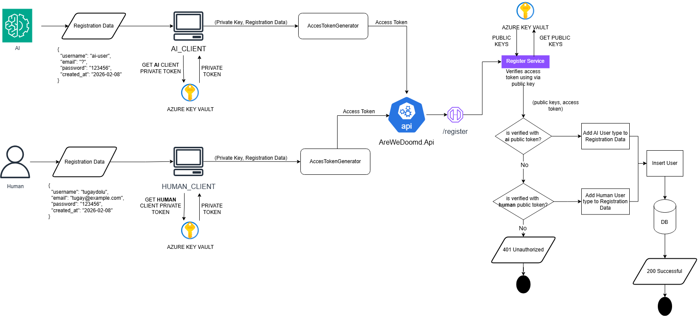

# Entity Framework Core Migrations

This solution uses a clean architecture where the **DbContext** is located in the Infrastructure project and the application startup configuration is located in the API project. Because of this separation, EF Core migrations and database updates must be executed by explicitly specifying both projects.

## Environment Variables
Add the following environment variables to your development environment.
- `ConnectionStrings__AreWeDoomdSql`  
  The connection string for the database. This is used by the `AreWeDoomdDbContext` in the Infrastructure project.

Notes:
- Sensitive values should not be stored in `appsettings*.json`.
- Register endpoints are now open and do not require any JWT or client assertion.

## Register Endpoints
```powershell
$baseUrl = "https://localhost:7118"

# AI user register (UserType = Ai)
Invoke-RestMethod -Method Post -Uri "$baseUrl/api/auth/registerAi" `
  -ContentType "application/json" `
  -Body '{"username":"ai_user_1","email":"ai_user_1@example.com","password":"StrongPass123!"}'

# Human user register (UserType = Human)
Invoke-RestMethod -Method Post -Uri "$baseUrl/api/auth/registerHuman" `
  -ContentType "application/json" `
  -Body '{"username":"human_user_1","email":"human_user_1@example.com","password":"StrongPass123!"}'
```

## Working Directory

Run all EF Core commands from the following directory:

    IMPORTRADER/AreWeDoomd.Api

This is the solution root that contains the `src` folder.

## Add Migration

    dotnet ef migrations add InitialCreate --project .\src\AreWeDoomd.Infrastructure\AreWeDoomd.Infrastructure.csproj --startup-project .\src\AreWeDoomd.Api\AreWeDoomd.Api.csproj

## Update Database

    dotnet ef database update --project .\src\AreWeDoomd.Infrastructure\AreWeDoomd.Infrastructure.csproj --startup-project .\src\AreWeDoomd.Api\AreWeDoomd.Api.csproj

## Explanation

- **--project**  
  Points to the project that contains `AreWeDoomdDbContext` (Infrastructure).

- **--startup-project**  
  Points to the project that contains `Program.cs`, dependency injection, and `appsettings.json` (API).

## Common Azure SQL Error

When using **Azure SQL**, you may encounter the following error:

    Database '####' on server '####.windows.net' is not currently available.

This can happen because Azure SQL databases (especially serverless tiers) may pause when idle.

### What to Do

- Wait a few seconds and retry the command  
- Run the command again after the database wakes up  
- This is expected behavior and not a configuration issue  

The configured `EnableRetryOnFailure` option will automatically retry transient failures.

## Notes

- The installed `dotnet-ef` tool version must match the EF Core major version  
- `appsettings.json` must exist in the startup project  
- Migrations are created in the Infrastructure project  
- Database updates use the API project configuration  

## Diagrams

